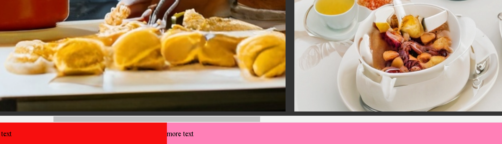
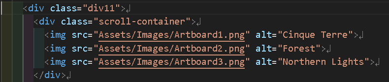
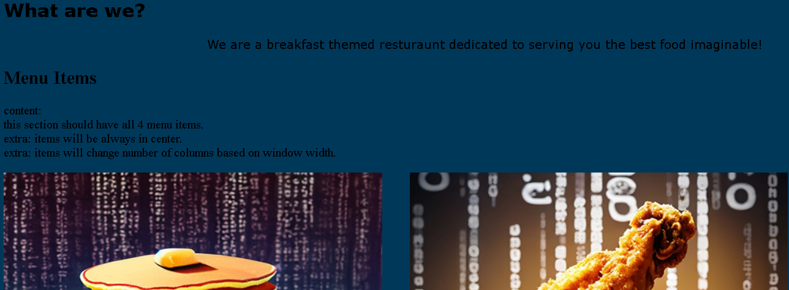
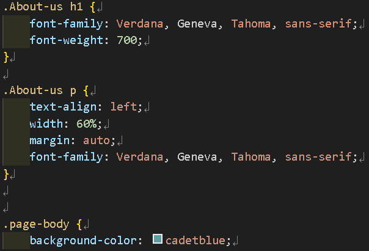
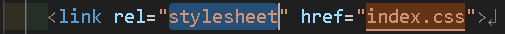

# HackSprint Website: Betty's Breakfast Bistro

This repository contains the web front-end for Betty's Breakfast Bistro

Within, there are demonstrations of the following techniques:

- [HackSprint Website: Betty's Breakfast Bistro](#hacksprint-website-bettys-breakfast-bistro)
    - [Fetching Local Assets](#fetching-local-assets)
    - [Internal Links](#internal-links)
    - [CSS Stylesheets](#css-stylesheets)
    - [Supplimentary Resources](#supplimentary-resources)

[Trello Checklist](https://trello.com/b/0zztTMTw/ndhlovu-rosencutter-hacksprint)

placeholder: summarize the steps we took to create the front-end

placeholder: image of trello category for the sections and how we did them

### Fetching Local Assets

    

        
The Creation

        
    

 
    

        
The Code

        
    

  

### Internal Links
* placeholder: image of Navigation bar
* placeholder: image of code for that navigation bar

### CSS Stylesheets
* placeholder: image of part of website that uses a style
* placeholder: image of css code that applies to the above "part of website that uses a style"
* placeholder: image of html file that pulls from css file

    

        
The Creation

        The text is intentionally and specifically styled:
        
    

 
    

        
The Code

        The style is defined within a css file:
        
        The css file is linked as the stylesheet for the html document:
        
    

  

### Supplimentary Resources

* [creating image grids](https://www.w3schools.com/howto/howto_js_image_grid.asp)

